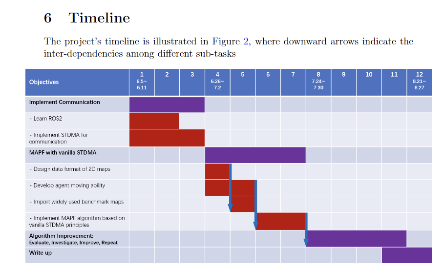

<!--
 * @Author: “Vehshanaan” 1959180242@qq.com
 * @Date: 2023-05-25 12:57:36
 * @LastEditors: “Vehshanaan” 1959180242@qq.com
 * @LastEditTime: 2023-05-26 16:35:11
 * @FilePath: \Dissertation2022\日志\5.25-6.1.md
 * @Description: 
 * 
 * Copyright (c) 2023 by ${git_name_email}, All Rights Reserved. 
-->
## 第1周

### 发生的事情

重启毕设计划，继续。

### 待办事项

整理之前设计的时间线，开始第一阶段的活

### 计划

### 问题

### 会议记录

### 流水账

**5.25**

升了win11，配置了wsl2的ubuntu 22.04环境，装了ros2humble。准备继续。

**5.26**

计划在接下来一周左右学一下ROS2

[开始学](https://www.bilibili.com/video/BV1gr4y1Q7j5?p=8&vd_source=af56ed07e3d99d90152bd89c609b3c4b)。

| grep 关键词 筛选ubuntu指令输出

**5.27**

接着学，昨天刚写了节点，今天接着看这个面向过程节点编写

[VsCode的intellisense和别的一堆东西的设置](https://www.youtube.com/watch?v=hf76VY0a5Fk&ab_channel=RoboticsBack-End)

把pylance搞炸了，用wsl环境修好了，以后就用wsl的vscode写吧。没推进课程进展。他妈的。

**5.28**

今天的目标是往后看完两个大主题

一个面向对象节点，一个后面的主题

**5.29**

接着学

接口（话题用的msg格式）

