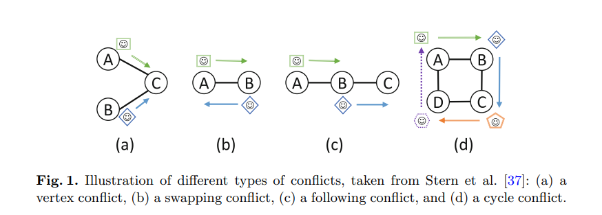
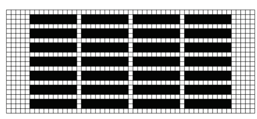

## 第5周

### 发生的事情

### 待办事项

### 计划

### 问题

### 会议记录

下周后续：
 - 做一个计划信道，只用于分享计划
 - 何时进行自己的计划（自己槽位说话前的部分），何时分发自己的计划会是一个有点tricky的部分。我得搞一搞，这是下周的内容
 - 将他的代码和我的融合。

展望：
 - 将地图分割，分成不同的区域，每个区域用一个信道，然后考虑安全区域的事情：
  - 只有一个站点拥有一个本区域slot时，他才有此区域资源的使用权
  - 想换区的时候，听着下一区，。。。
  - 下次老实承认，自己的栈溢出了，重分析一次

 - 走廊问题；
  - 如果我要走的路被挡住了：我发送一个建议计划（可能是对方退避，可能是自己退避），然后根据自己提出的建议走
  - 另一方观察我的行为，如果我进行了某计划，他就采取某些措施，来响应这个计划
  - 之所以只是建议，就是因为不能两个人相互躲着。像走廊上互相左右闪的那种情况，俩人都退避了又都坚持了又都退避了。。。
  - Serial DMPC。这些都是后面一点的活，不着急。先写`下周后续`

### 流水账

**6.22**

想好了解法：节点的移动其实是在三维空间中寻找一条无碰撞路径，第三维是时间。

我想先给他看看那个样例，再看他的回馈。

笔记：四种常见的冲突：

四种常见的衡量标准地图：

 - DAO 地图
 - 空白地图
 - 有随机障碍物的地图
 - warehouse

 

 **6.23**

 本周任务：
  - 弄出计划相互传递的方式
  - 搞清楚时间链条上什么时候可以筹谋，什么时间可以发送
  - 实现带有计划分享的寻路
  - 集成地图

今天在老师的节点代码里简单写了寻路，计划生成，计划压缩解压缩，地图读取，唯一初始位置生成，地图中心点计算。

**6.24**

接着写。

今天写计划分享和基于其他人计划的自己计划。以及试着实现地图。

写了计划分享。接下来思考怎么搞基于其他人计划的自己计划，计划的保存和每一步的销毁。。

  

